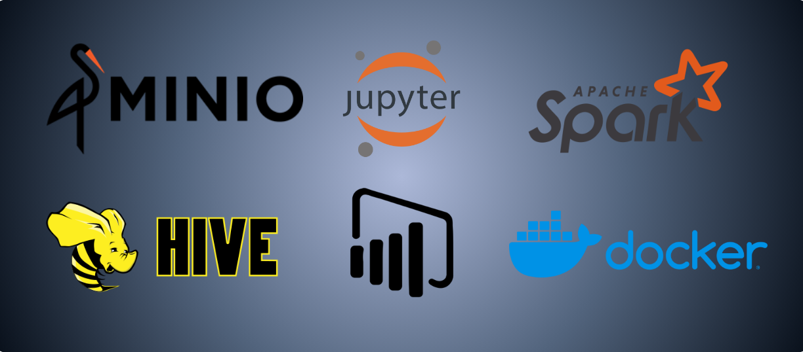
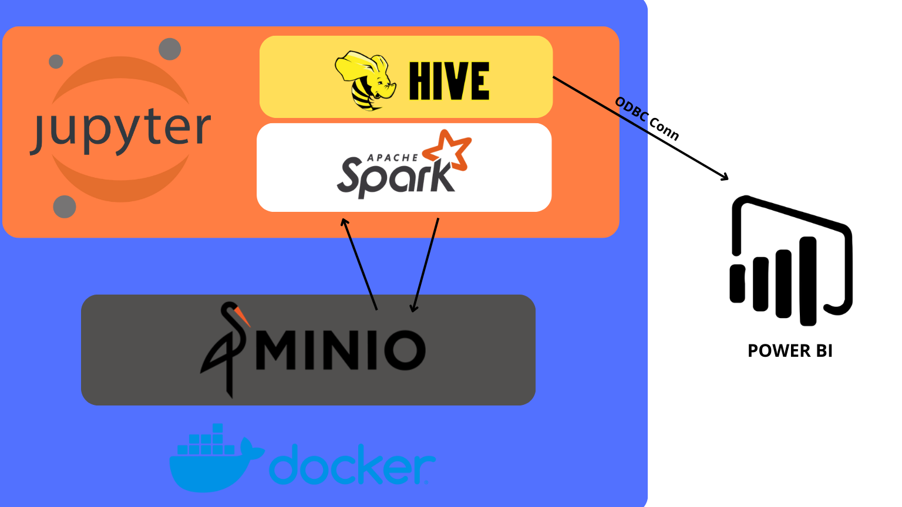

# Proyecto de Análisis de Datos

#### **¿Por qué este proyecto?** 
Este proyecto se ha diseñado con el objetivo de enfrentar y superar los desafíos típicos que un analista de datos encuentra en su día a día. A través de la aplicación de tecnologías avanzadas como Spark, Hive y Power BI, buscamos no solo demostrar un flujo completo de análisis de datos, sino también abordar problemas reales de procesamiento, análisis y visualización de datos.

#### **¿Qué estamos analizando y por qué?** 
En este proyecto, nos enfocamos en analizar un conjunto de datos de un negocio de retail para extraer información valiosa que pueda ser utilizada en la toma de decisiones estratégicas. Este análisis incluye la limpieza, exploración y modelado de datos para entender patrones clave y comportamientos de los usuarios.

#### **¿Qué vamos a hacer?**

- Carga de Datos en MinIO
- Lectura de Datos
- Análisis Exploratorio de Datos (EDA)
- Análisis RFM
- Creación de Base de Datos con Hive Metastore
- Visualización en Power BI

### Pasos:

#### 1. Carga de Datos en MinIO

El primer paso consiste en cargar la tabla de datos con la que vamos a trabajar en un bucket de MinIO, almacenamiento compatible con S3 que permite manejar datos de manera escalable y segura.

####  2. Lectura de Datos con Pandas y Spark en Jupyter Notebooks

Una vez los datos están cargados en MinIO, se leen utilizando Pandas con Spark integrado desde Jupyter Notebooks. Esta integración permite aprovechar las capacidades de procesamiento distribuido de Spark mientras se mantiene la flexibilidad de Pandas para la manipulación de datos.

#### 3. Análisis Exploratorio de Datos (EDA)

Después de leer los datos, se realiza un Análisis Exploratorio de Datos (EDA) para entender mejor las características y la estructura de los datos. Este paso incluye la limpieza de los datos, donde se manejan valores nulos, se corrigen inconsistencias y se preparan los datos para el análisis posterior.

[Notebook: Análisis Exploratorio de Datos](/notebooks/EDA_retail.ipynb)

#### 4. Análisis RFM

El análisis RFM (Recency, Frequency, Monetary) es una técnica de segmentación de clientes basada en su comportamiento de compra. Este análisis ayuda a identificar segmentos clave de clientes según:

- **Recency (Recencia):** Cuánto tiempo ha pasado desde la última compra.
- **Frequency (Frecuencia):** Cuántas veces ha comprado un cliente en un período determinado.
- **Monetary (Monetario):** Cuánto ha gastado un cliente en total.

Al clasificar a los clientes según estos tres parámetros, es posible identificar a los clientes más valiosos y personalizar estrategias de marketing para cada segmento.

[Notebook: RFM-Analisis](/notebooks/RFM_retail.ipynb)

#### 5. Creación de Base de Datos con Hive Metastore

Una vez realizado el análisis RFM y el EDA, los datos se almacenan en una base de datos utilizando Hive Metastore. Usando PySparkSQL, se crea la estructura de la base de datos que luego será utilizada para la visualización de datos en el dashboard.

[Notebook: Creacion de Database](/notebooks/Database.ipynb)

#### 6. Visualizando los Datos con Power BI

Finalmente, los datos almacenados en Hive Metastore se extraen en Power BI para la creación de un dashboard interactivo. Este dashboard permite a los usuarios explorar los datos de manera visual y obtener insights valiosos para la toma de decisiones.

#### DevOps Engine - Docker

Finalmente, quiero destacar que todo el proyecto fue desarrollado utilizando Docker. El código incluye un Makefile que proporciona los comandos necesarios para ejecutar toda la aplicación en cualquier máquina que tenga Docker instalado.

Dentro del entorno Docker, también están disponibles los siguientes servicios:

- **Spark-Thrift-Server**: Utilizado para exponer nuestras base de datos.
- **Hive**: Utilizado como servicio de metastore.
- **MySQL**: Como almacenamiento para Hive.

Además de los servicios ya mencionados, como **Jupyter**, **Spark** y **MinIO**.

## Conclusión

Este proyecto demuestra cómo un flujo de trabajo bien definido y el uso de herramientas modernas pueden facilitar un análisis de datos efectivo y escalable. Desde la carga de datos hasta la visualización en un dashboard, cada paso es crucial para obtener insights que pueden ser utilizados en la toma de decisiones estratégicas.

Eso es todo por ahora. Si te gustó, ¡me encantaría que dejaras una estrella en el repositorio de GitHub! 😉

